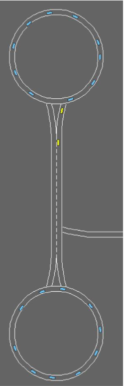
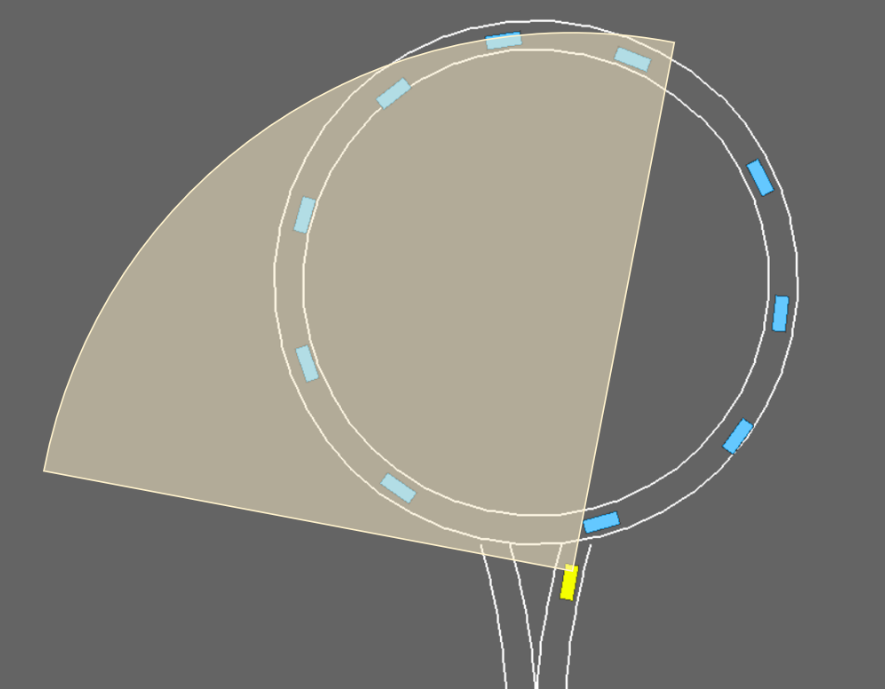
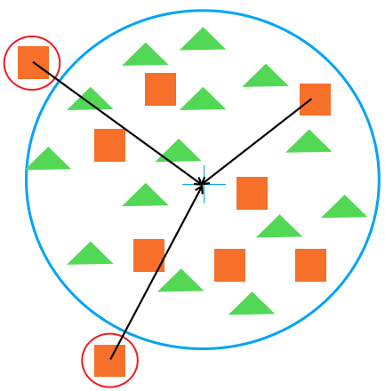
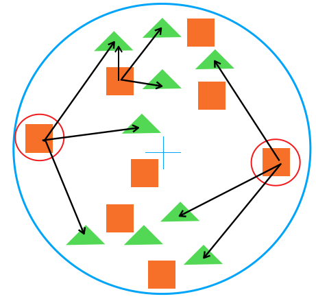

# Artificial-decision-making-of-autonomous-vehicles-AI

This project is based on self driven vehicles facing roundabout entering situations. In order to machine learn the simulated environment, two phases have been implemented:

- Training; where experiences at driving are collected in form of rules, and stored in a rule book.
- Testing; the rule most alike to the faced testing situation will be selected and its performance evaluated in terms of the risk taken and whether or not a crush was produced.

The training is intended to reduce as well as decentralize the rule book generated, this way each vehicle has its own small sized rule book. In order to do this and at the same time to improve the learning, vehicles are allowed to exchange information when they are outside the roundabout using an exchange algorithm developed in this project, called Cluster of Knowledge COK.

 

**Cluster of knowledge**

What is meant by cluster of knowledge (COK) on the present scientific work, is a reference of the experience of each individual. In other words, the whole of the observations that each individual has collected; either by experience driving into the roundabout or by exchanging information with other individuals.

In order for an individual to be considered wised, its cluster of knowledge should be as wide and well spread as possible, which means that it should include observations situated in as much of the featured space as possible. To achieve this, two sub-sections have been defined inside the concept of cluster of knowledge; center based COK and gap based COK.

**Center based**

In order to establish this concept, it is important to mention what is a center based cluster in the conventional way. A cluster whose center is specified and belonging elements are defined in terms  of their proximity to the mentioned center is often called center based cluster, where the goal is to group the most similar elements.

However, for the center based COK this concept has been applied in reverse, aiming to expand the cluster size by including into it the farthest elements from the cluster center. This way the observations that the cluster includes are as dissimilar as possible, and therefore the knowledge of the corresponding individual from the featured space is wide.

This can be seen in the following picture, where the green triangles are the elements already belonging to the cluster, and the orange squares are the elements that can be included. As it can be seen in the mentioned figure, the squares whose distance to the center is greater are selected to become part of the cluster.

**Gap based**

A wised individual has a wide and well spread set of observations; where COK center based is in charge of wideness and COK gap based is in charge of good dispersion.

In order to achieve its purpose, this version of COK instead of looking at the center of the cluster, it identifies the distance between each and every element of the cluster with respect to the rest, out of this information it finds as its name indicates, the biggest gap in the cluster as the greatest distance between two cluster elements.

Once the biggest gap and the two cluster elements involved are identified, the middle point between the tow is identified; this is done, so that in the next step the closest available element to this point can be found and included to the cluster as it can be seen in the picture below.

